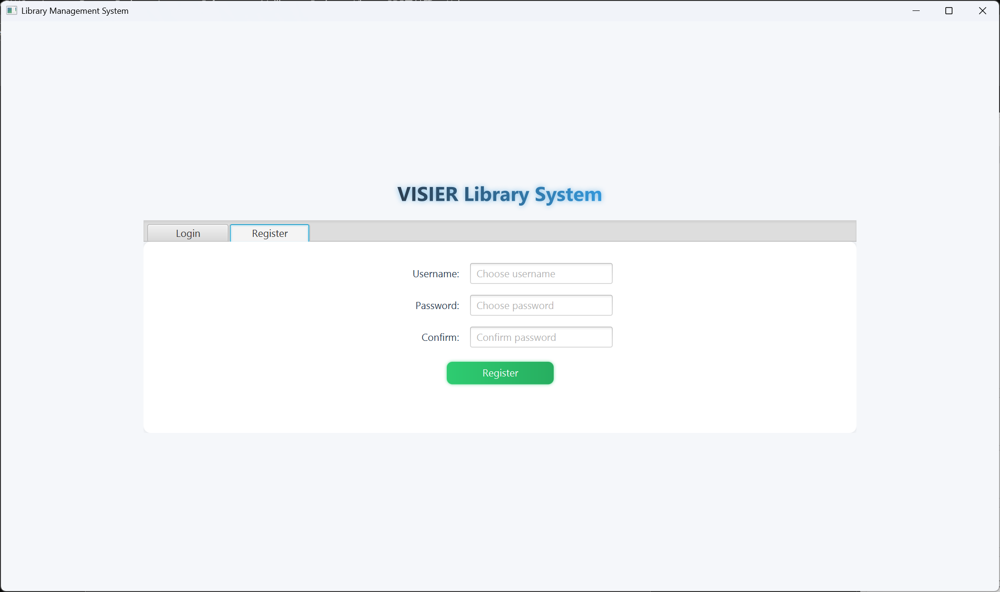

# Contents

1. [Introduce](#1-introduce)  
   1.1 [Technology stack](#11-technology-stack)  
   1.2 [Main Plugins && Software](#12-main-plugins--software)  
   1.3 [Interface](#13-interface)  
   1.4 [Database](#14-database)  
2. [Requirement Analysis](#2-requirement-analysis)  
   2.1 [System Modules Analysis](#21-system-modules-analysis)  
3. [Project Design](#3-project-design)  
   3.1 [Entity Design](#31-entity-design)  
   3.2 [Database Design](#32-database-design)  
   3.3 [Interface Design](#33-interface-design)  
   3.4 [UI Design](#34-ui-design)  
4. [Project Compose](#4-project-compose)  
   4.1 [Project Directory Fast View](#41-project-directory-fast-view)  
   4.2 [Class Relationship & Workflow](#42-class-relationship--workflow)  
5. [Algorithm Design](#5-algorithm-design)  
   5.1 [Collaborative Filtering Algorithm](#51-collaborative-filtering-algorithm)  
   5.2 [Multi Thread Design](#52-multi-thread-design)  

## 1 Introduce

### 1.1 Technology stack
This project applied Java FX, Java.net, org.json for the front-end and Jackson, Javalin, jdbc:sqlite for the back-end. And they were communicated with HTTP protocol.

### 1.2 Main Plugins && Software

  
*Figure1.2.1 Better Comments Rule*

  
*Figure1.2.2 Mermaid Design*

1. Better Comments which give me the better comments experience  
2. GitHub copilot, most of the time, the advice given is incorrect and is usually only used to batch modify code with the same structure  
3. SQlite Viewer which helped me to check my operation  
4. Postman which helped me to test the interface  
5. Mermaid, a mark language which helped me design the System Architecture  

### 1.3 Interface
Due to the RESTful Design Rule, the interface in this project is especially easy to distinguish.  
And these interfaces also use JWT for permission verification and identity authentication, thereby reducing the parameter passing of some requests  

### 1.4 Database
To simplify this project, and consider the portability, I chose the sqlite as the Database which could fully competent for this work.

## 2 Requirement Analysis

### 2.1 System Modules Analysis

#### 2.1.1 User
1. User registration and login (distinguishing between normal users and admins)  
2. Book search (by title, author, category)  
3. Personalized book recommendation (use collaborative filtering or content-based filtering)  
4. Borrowing books, returning books, viewing borrowing records  
5. Overdue reminders  

#### 2.1.2 Admin
1. Add, update, delete book records  
2. View all borrowing records  
3. View most popular books or trending statisctics  
4. Manage user accounts (e.g., freeze or unfreeze accounts or promote)  

#### 2.1.3 Analysis:

  
*Figure2.1.3.1 System Module*

Explain:  
This graph divde the system into three module by function. And to simplify the project I reuse some pages of User/Admin Module I design the views by module function), which means I only hiden some operation entry for user within some views. And the Core Funtionality Module was embeded into the other modules.  

  
*Figure2.1.3.2 Simple Module*

## 3 Project Design

### 3.1 Entity Design

  
*Figure3.1.1 Class Entity Design*

Explain:  
There five classes, they are User, Normal User, Admin, Book, BorrowRecord. And the User is the abstract class which was derived by Normal User and Admin.  
And these classes used the javafx.beans.property as their property so that properties can be bound to FXML, allowing for automatic synchronization of values when one property changes.

### 3.2 Database Design

  
*Figure3.2.1 Database Schema*

Explain:  
This database schema efficiently models a book borrowing system with three core tables: users (storing user accounts with roles like admin or normal and frozen status), books (containing book details including availability), and borrow_records (tracking borrowing activities with dates, statuses like BORROWED/RETURNED/OVERDUE, and foreign keys linking users and books). The design enforces proper relationships—each user can borrow multiple books (1:N), and each book can be borrowed by multiple users (1:N)—while maintaining data integrity through foreign keys and enabling features like overdue tracking, user account management, and book availability monitoring. The schema is normalized, scalable, and well-suited for a library or similar book management application.

### 3.3 Interface Design

  
*Figure3.3.1 Interface Total View*

Explain:  
These interface design adopts a clear RESTful style and modular layering, visually expressing resource relationships through semantic paths such as/users and/books, and ensuring security through JWT unified authenticat And these interfaces also use JWT for permission verification and identity authentication, thereby reducing the parameter passing of some requests And these interfaces also use JWT for permission verification and identity authentication, thereby reducing the parameter passing of some requests ion; Using HTTP methods (GET/POST/PATCH) to strictly correspond to CRUD operations, special state changes (such as/freeze,/return) are explicitly declared through sub paths, making the API self interpretable; Simultaneously reserving a WebSocket channel for real-time notifications, balancing the simplicity of standardization and the flexibility of business expansion, significantly reducing the cost of front-end and back-end collaboration.

And detail codes as fellow:

  
*Figure3.3.2 User Management Routes*

  
*Figure3.3.3 Book Management Routes*

  
*Figure3.3.4 BorrowRecords Management Routes*

### 3.4 UI Design

  
*Figure3.4.1 Login View*

  
*Figure3.4.2 Register View*

  
*Figure3.4.3 Successful Notification*

#### 3.4.1 Admin Views:

  
*Figure3.4.1.1 Statics View*

  
*Figure3.4.1.2 Book Management View*

  
*Figure3.4.1.3 BorrowRecords Management View*

  
*Figure3.4.1.4 User Management View*

#### 3.4.2 User Views

  
*Figure3.4.2.1 User Recommendation && profile*

  
*Figure3.4.2.2 User Book View*

  
*Figure3.4.2.3 User Borrow Records View*

## 4 Project Compose

### 4.1 Project Directory Fast View
Here's the fast view about the Project, which contain the Front-end, Back-end, and System-Design-Mermaid.

```plaintext
E:.
├─CourseDesign
│ ├─.idea
│ ├─.mvn
│ │ └─wrapper
│ ├─src
│ │ └─main
│ │ ├─java
│ │ │ └─org
│ │ │ └─visier
│ │ │ └─coursedesign
│ │ │ ├─ApiClient
│ │ │ ├─Controller
│ │ │ ├─Entity
│ │ │ ├─Manager
│ │ │ ├─Service
│ │ │ ├─Session
│ │ │ └─Utils
│ │ └─resources
│ │ └─org
│ │ └─visier
│ │ └─coursedesign
│ │ └─view(fake)
│ └─target
│ └─classes
├─CourseDesignServer
│ ├─.mvn
│ ├─src
│ │ ├─main
│ │ │ ├─java
│ │ │ │ └─org
│ │ │ │ └─JBR
│ │ │ │ ├─DAO
│ │ │ │ ├─Javalin
│ │ │ │ ├─Service
│ │ │ │ ├─Socket
│ │ │ │ ├─Sqlite
│ │ │ │ └─Utils
│ │ │ └─resources
│ │ └─test
│ │ └─java
│ └─target
│ └─classes
└─SystemDesign
├─DB
├─Entity
├─Interface
├─Module
├─Relationship
└─Workflow
```


### 4.2 Class Relationship & Workflow
The Relation will displayed with the format of mermaid Graph as fellow:

  
*Figure4.2.1 FrontEnd Package Relationship*

Explain:  
When a Sence loaded,There are two Views instantiated when the application started, and they were recoreded by SenceManager.When the views loading the Controller will work, and the Entity was corrospending to the components of controller FXML.The Session was used to record the current session property like current user, route history, operation history ....

  
*Figure4.2.2 BackEnd Package Relationship*

Explain:  
When a http request received(the websocket was connected by once http request), the Javalin worked, and verfiy the JWT to make sure the Routing Permission was right. Javalin was linked to the Service and the Service will instantiate the DAO and use the function which used to get data from sqlite.

  
*Figure4.2.3 System Interaction Flow*

Explain:  
This graph displayed a compete workflow of my Library System. Any other sequence is same as this for example, the login:

  
*Figure4.2.4 System Interaction Flow*

## 5 Algorithm Design

### 5.1 Collaborative Filtering Algorithm

  
*Figure5.1.1 Collaborative Core Function*

  
*Figure5.1.2 Content based fliter*

Explain:  
This is a two-stage collaborative filtering algorithm based on book type and content enhancement. This collaborative filtering algorithm recommends books by analyzing borrowing patterns, identifying users with similar preferences through cosine similarity, and suggesting titles they've enjoyed. It combines personalized recommendations based on individual history with popular books across the library, while handling new users through genre-based suggestions.

### 5.2 Multi Thread Design

  
*Figure5.2.2 Multi Thread Setting*

Explain:  
QueuedThreadPool is a built-in thread pool implementation in Jetty, specifically designed to handle HTTP requests.  
The current code indicates that the thread pool can run up to 500 threads simultaneously. When initializing the thread pool, 50 minimum idle threads will be created. If a thread is idle for more than 6 seconds, it will be reclaimed until there are minThreads remaining. 

  
*Figure5.2.3 Database Multi Thread Safe*

Explain:  
This SQLiteHelper class achieves thread safety through several mechanisms: HikariDataSource is thread-safe and can be safely shared across multiple threads; DateTimeFormatter is inherently thread-safe and can be used concurrently without synchronization; connection acquisition is atomically managed by the connection pool, preventing concurrency issues; and each thread obtains its own independent connection, avoiding resource contention. Furthermore, the PreparedStatement and ResultSet objects used within methods are local variables, which naturally provide thread isolation and prevent inter-thread interference.  
The design ensures safe concurrent database access while maintaining high performance through these thread-safe components and proper resource scoping.